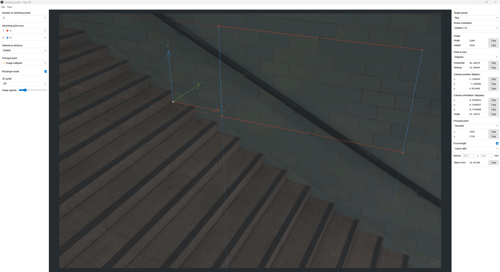

## What is this?

fSpy is an open source, cross platform app for still image camera matching. See [fspy.io](https://fspy.io) for more info. The source code is available under the GPL license.

## Purpose of this fork

fSpy-UE started as a fork of fSpy focused on making the camera matching workflow easier to use with [Unreal Engine](https://www.unrealengine.com/). The first goal was to add a target preset that displays fSpy's solved camera in Unreal-friendly coordinates, units and rotation order.

The goal is now broader: keep the app maintained on a modern Electron/React toolchain while preserving fSpy's original calibration model and adding target presets for more applications over time. The solved camera data remains compatible with fSpy, while the UI and exports can present that same camera in target-specific coordinate systems.

The fork currently includes Unreal Engine and Blender target presets, scene orientation options, target-specific camera rotation display and a target camera JSON export. Future presets can follow the same approach for other DCCs, engines or rendering tools.



## Using the computed camera parameters in other applications

In theory, camera parameters computed by fSpy could be used in any application that has a notion of a 3D camera and provides some way of setting the camera parameters. If you're a Blender user, have a look at the [official fSpy importer add-on](https://github.com/stuffmatic/fSpy-Blender). If you're using an application without a dedicated importer, you may still be able to manually copy the camera parameters from fSpy.

Interested in writing an importer for your favorite application? Then the [fSpy project file format spec](https://github.com/stuffmatic/fSpy/blob/develop/project_file_format.md) is a good starting point.

## Building and running

The following instructions are for developers. If you just want to run the app, download the latest build from the [fSpy-UE releases page](https://github.com/EnneiteG/fSpy-UE/releases).

fSpy is written in [TypeScript](https://www.typescriptlang.org) using [Electron](https://electronjs.org), [React](https://reactjs.org) and [Redux](https://redux.js.org). [Visual Studio Code](https://code.visualstudio.com) is recommended for a pleasant editing experience.

Node.js 22 is the recommended development runtime for the current Electron build stack. The repository includes an `.nvmrc` file for this purpose. npm is the package manager for this fork.

To install necessary dependencies, run:

```
npm ci
```

The `src` folder contains `main` and `gui`, containing code for the [Electron main and renderer processes](https://electronjs.org/docs/tutorial/application-architecture) respectively, and `cli`, which contains a command-line interface for processing fSpy project files without the GUI. The main process includes a preload script (`src/main/preload.ts`) that bridges the renderer and main processes via IPC.

Here's how to run the app in development mode:

1. Run `npm run build-dev` once to generate the main process, preload and renderer bundles.
2. Run `npm run dev-server` in a separate terminal tab to start the renderer dev server.
3. Run `npm run electron-dev` in another terminal tab to start Electron against the dev server.

To test a packaged app without creating installers, run:

```
npm run dist-preview
```

On Windows, this creates an unpacked app in `dist/win-unpacked`.

When launching the unpacked app from a terminal, make sure `ELECTRON_RUN_AS_NODE` is not set. That variable is used by Electron tooling to run Electron as a Node.js binary; if it leaks into the app launch environment, the app exits immediately instead of opening a window. In PowerShell, clear it for the current session with:

```powershell
Remove-Item Env:ELECTRON_RUN_AS_NODE -ErrorAction SilentlyContinue
```

## Creating binaries for distribution

To create installers and archives for all configured platforms, run:

```
npm run dist
```

which invokes [Electron builder](https://github.com/electron-userland/electron-builder).

To create a Windows installer locally, run:

```
npm run dist-win
```

On Windows, this creates an x64 NSIS setup executable and zip archive in `dist/`. GitHub also has a `Windows Release` workflow that builds the same installer and archive. Pushing a tag such as `v0.5.0-ue` creates a GitHub Release and attaches the generated files. The generated file names use the version from `package.json`.
